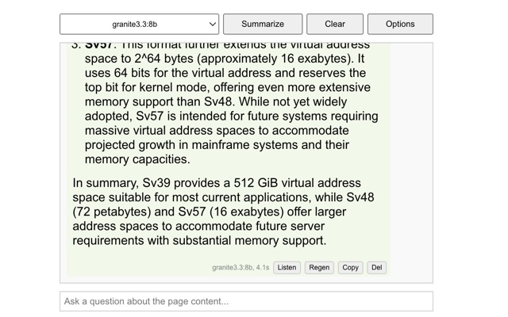

# WebAI Chrome Extension

WebAI is a Chrome extension that leverages local AI models to summarize the content of the current webpage and answer your questions about it.

[](https://github.com/miolini/webai/actions/workflows/release.yml)

## Demo

[](https://www.youtube.com/watch?v=E1w6sXFI-ec)

## Screenshot



## Features

*   **Summarize Webpages:** Get concise summaries of the webpage you are currently viewing.
*   **Ask Questions:** Interact with the page content by asking follow-up questions.
*   **Local LLM Support:** Connects to a local Large Language Model (LLM) service (like Ollama) for processing.
*   **Model Selection:** Choose from available LLM models provided by your local service.
*   **Text-to-Speech:** Listen to summaries and answers using a local Text-to-Speech (TTS) service.
*   **Conversation History:** Chat history is automatically saved and restored based on the webpage URL.
*   **Configurable Endpoints:** Set custom URLs for your LLM and TTS services via the Options page.
*   **Easy Interaction:** Copy messages or clear the conversation history with dedicated buttons.

## Requirements

*   **Local LLM Service:** A running instance of an LLM service compatible with the Ollama API (e.g., Ollama, Jan, LM Studio). The default endpoint is `http://localhost:11434`.
*   **Local TTS Service:** A running instance of a Text-to-Speech service compatible with the OpenAI `/v1/audio/speech` API endpoint. The default endpoint is `http://localhost:8880`.
*   **Browser:** Google Chrome or a Chromium-based browser that supports Manifest V3 extensions.
*   **Docker:** For easily deploying the required services.

### Deploying Services with Docker (Recommended)

You can use Docker to easily run the required LLM and TTS services:

1.  **Run Ollama:**
    ```bash
    docker run -d --gpus=all -v ollama:/root/.ollama -p 11434:11434 --name ollama ollama/ollama
    ```
    *   This command downloads the Ollama image and runs it in a container named `ollama`.
    *   It exposes port `11434` for the API.
    *   `--gpus=all` enables GPU acceleration if you have NVIDIA drivers installed. Remove this if you don't have a compatible GPU or drivers.
    *   You will need to pull models after starting Ollama (e.g., `docker exec -it ollama ollama pull llama3`).

2.  **Run Kokoro-FastAPI (TTS):**
    ```bash
    docker run -d -p 8880:8880 --name kokoro-fastapi ghcr.io/remsky/kokoro-fastapi:latest
    ```
    *   This command downloads the Kokoro-FastAPI image and runs it in a container named `kokoro-fastapi`.
    *   It exposes port `8880` for the TTS API.

Ensure Docker is installed and running on your system before executing these commands.

## Installation

1.  Clone or download this repository to your local machine.
2.  Open your Chrome browser and navigate to `chrome://extensions/`.
3.  Enable **Developer mode** using the toggle switch in the top-right corner.
4.  Click the **Load unpacked** button.
5.  Select the directory where you cloned or unzipped the repository files.
6.  The WebAI extension icon should appear in your browser toolbar.

## Configuration

1.  Ensure your local LLM and TTS services are running (either via Docker or other methods).
2.  Right-click the WebAI extension icon in your toolbar and select **Options**, or click the **Options** button within the extension popup.
3.  In the options page, enter the correct URLs for your LLM API endpoint (e.g., `http://localhost:11434`) and your TTS API endpoint (e.g., `http://localhost:8880`). If you used the Docker commands above, these defaults should work.
4.  Click **Save Options**.

## Usage

1.  Navigate to the webpage you want to summarize or ask questions about.
2.  Click the WebAI extension icon in your browser toolbar to open the popup.
3.  The extension will automatically attempt to fetch the page content. If a previous conversation exists for this URL, it will be loaded.
4.  Select the desired LLM model from the dropdown menu (models are fetched from your LLM endpoint). Make sure you have pulled the model into Ollama first.
5.  To ask questions, type your query into the input box at the bottom of the popup and press `Enter`.

**Main Actions (Top Bar):**

*   **Summarize:** Click the **Summarize** button to generate a summary of the page content. This will clear any existing conversation for the page.
*   **Clear:** Use the **Clear** button to remove the current conversation history for the page.
*   **Options:** Access the configuration page by right-clicking the extension icon and selecting **Options**, or by clicking the **Options** button within the popup (if available).

**Message Actions (Buttons below messages):**

*   **Listen:** Use the **Listen** button (speaker icon) on assistant messages to have the text read aloud by your TTS service.
*   **Copy:** Use the **Copy** button (clipboard icon) to copy the text content of any message.
*   **Regen:** Use the **Regen** button (appears under assistant messages or user messages that have received a reply) to regenerate the assistant's response.
*   **Del:** Use the **Del** button (appears under all messages) to delete a specific message from the conversation history.

## Privacy

WebAI is designed with privacy in mind, utilizing local AI services that you control. For detailed information on what data is processed and how it's handled, please refer to the [PRIVACY.md](PRIVACY.md) file.

## License

This project is licensed under the BSD 3-Clause License. See the [LICENSE](LICENSE) file for details.

## Author

*   Artem Andreenko ([AUTHORS](AUTHORS))